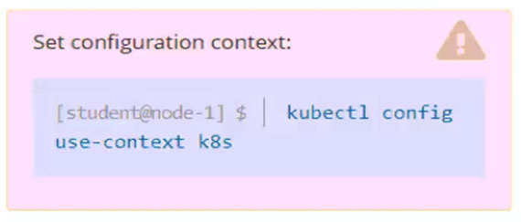

# Question 1:



#### Context -
You have been asked to create a new ClusterRole for a deployment pipeline and bind it to a specific ServiceAccount scoped to a specific namespace.

#### Task -
Create a new ClusterRole named ```deployment-clusterrole```, which only allows to create the following resource types:

✑ Deployment

✑ Stateful Set

✑ DaemonSet

Create a new ServiceAccount named ```cicd-token``` in the existing namespace ```app-team1```.
Bind the new ClusterRole ```deployment-clusterrole``` to the new ServiceAccount ```cicd-token```, limited to the namespace ```app-team1```.

## Correct Answer:

- Create a ClusterRole named "deployment-clusterrole" that allows user to perform ```create``` on Deployment, StatefulSet, DaemonSet:
```
kubectl create clusterrole deployment-clusterrole --verb=create --resource=Deployment,StatefulSet,DaemonSet
```

- Create a ServiceAccount named ```cicd-token``` in the namespace ```app-team1```:
```
kubectl create sa cicd-token -n app-team1
```

- Create a RoleBinding. Grant a role to the ```cicd-token``` service account in a namespace ```app-team1```:
```
kubectl create rolebinding deploy-xyz -n app-team1 --clusterrole=deployment-clusterrole --serviceaccount=app-team1:cicd-token
```

- Verify:
```
$ kubectl auth can-i create deployment -n app-team1 --as system:serviceaccount:app-team1:cicd-token
-> yes
```

```
$ kubectl auth can-i create deployment -n default --as system:serviceaccount:app-team1:cicd-token
-> no
```