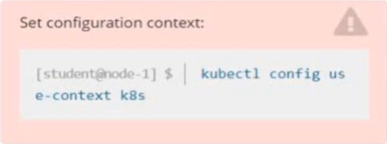
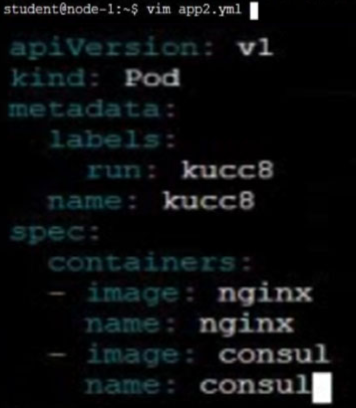
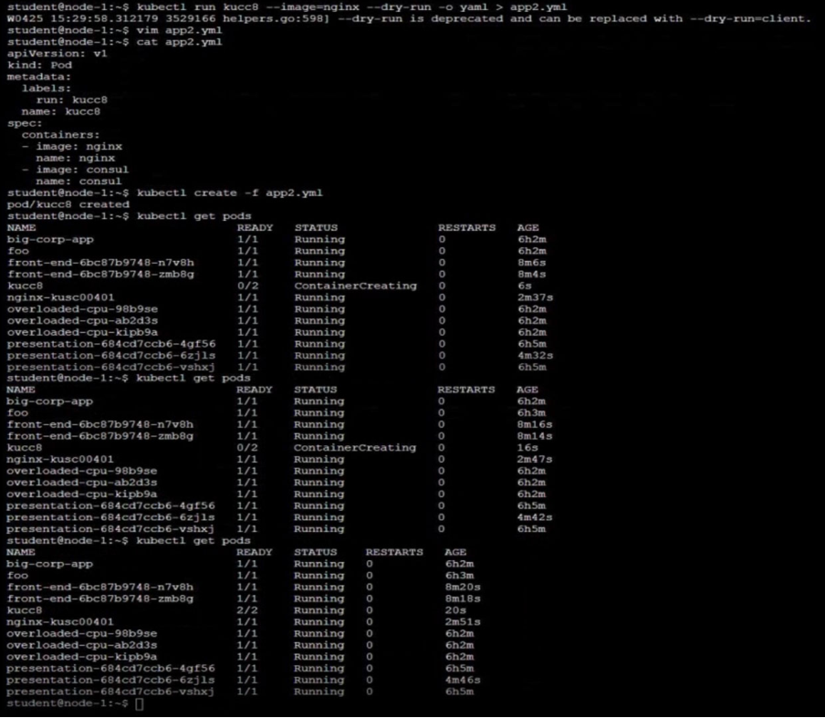

# Question 10:




#### Task -
Schedule a Pod as follows:

✑ Name: kucc8

✑ App Containers: 2

✑ Container Name/Images:

- nginx
- consul

## Correct Answer:





- This will give you a template for creating a Pod:
```
$ kubectl run kucc8 --image=nginx --dry-run=client -o yaml > pod.yaml
```

- Edit file ```pod.yaml```:
```
$ vi pod.yaml
...
apiVersion: v1
kind: Pod
metadata:
  labels:
    run: kucc8
  name: kucc8
spec:
  containers:
  - image: nginx
    name: nginx
  - image: consul
    name: consul
```

- Create a Pod ```kucc8```:
```
$ kubectl apply -f pod.yaml
```

- Check the Pod Status:
```
$ kubectl pod -w | grep kucc8
```