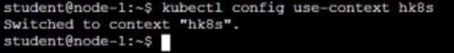

# Question 11:


#### Task -
Create a persistent volume with name ```app-data```, of capacity 2Gi and access mode ```ReadOnlyMany```. The type of volume is hostPath and its location is ```/srv/app- data```.

## Correct Answer:




- Create a PV:
```
$ vi app-data-pv.yaml
...
apiVersion: v1
kind: PersistentVolume
metadata:
  name: app-data
spec:
  capacity:
    storage: 2Gi
  accessModes:
    - ReadWriteOnce
  hostPath:
    path: "/srv/app- data"
```
```
$ kubectl apply -f app-data-pv.yaml
```