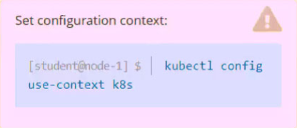
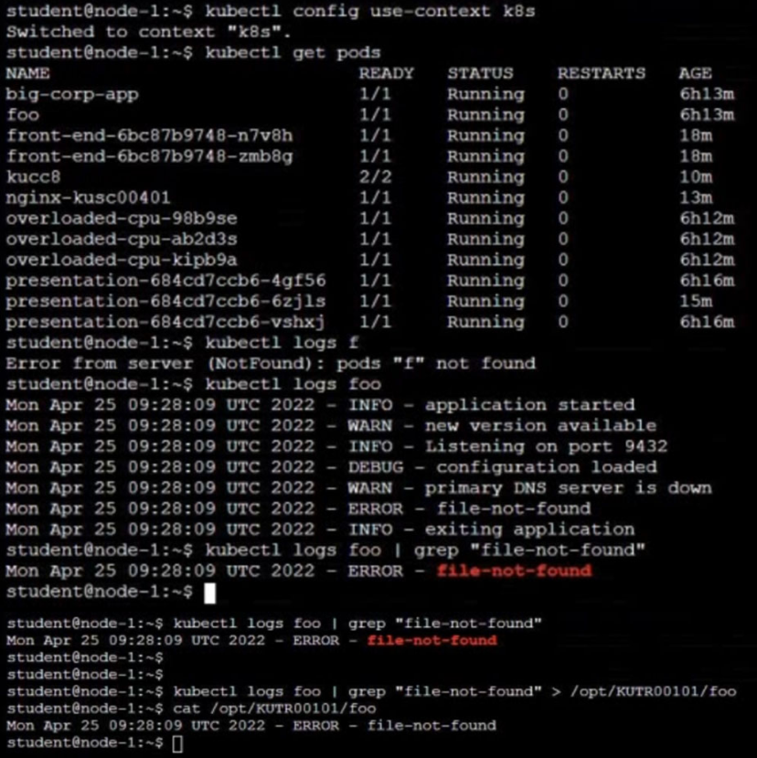

# Question 12:




#### Task -
Monitor the logs of pod ```foo``` and:

✑ Extract log lines corresponding to error ```file-not-found```

✑ Write them to /opt/KUTR00101/foo

## Correct Answer:



- Saving logs to the log file:
```
$ kubectl log foo | grep 'file-not-found' > /opt/KUTR00101/foo
```