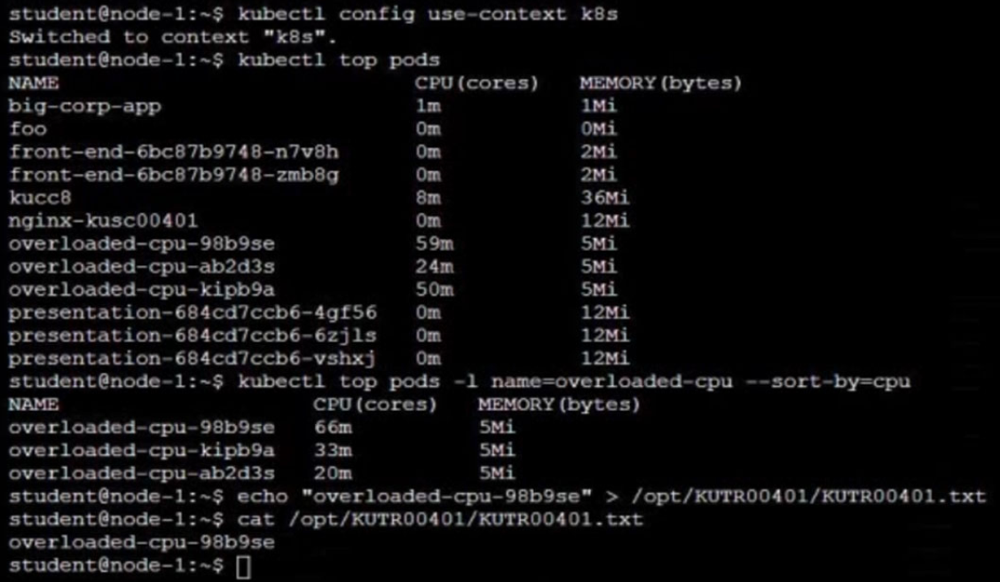

# Question 14:


#### Task -
From the pod label ```name=overloaded-cpu```, find pods running high CPU workloads and write the name of the pod consuming most CPU to the file ```/opt/```

KUTR00401/KUTR00401.txt (which already exists).

## Correct Answer:



- Show pods that are currently running with high CPU utilization:  
```
$ kubectl top pod
```
```
$ kubectl top pod -l name=overloaded-cpu -sort-by=cpu
Name                      CPU(cores)    MEMORY(bytes)
overloaded-cpu-98b9se     66m           5Mi
overloaded-cpu-kipb9a     33m           5Mi
overloaded-cpu-ab2d3s     20m           5Mi
...

$ echo "overloaded-cpu-98b9se" > KUTR00401/KUTR00401.txt
```