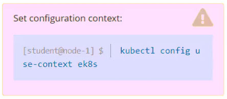
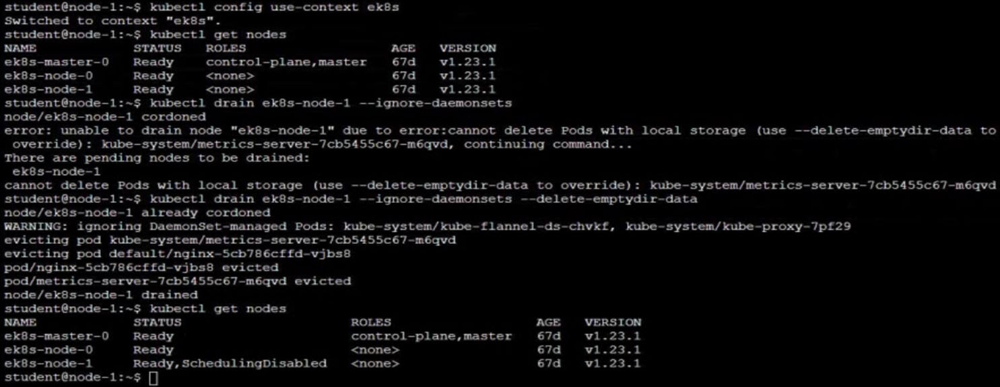

# Question 2:




#### Task -
Set the node named ```ek8s-node-0``` as unavailable and reschedule all the pods running on it.

## Correct Answer: 


- Use ```kubectl drain``` to remove a node from service
```
kubectl drain ek8s-node-0 --ignore-daemonsets --delete-emptydir-data
```
