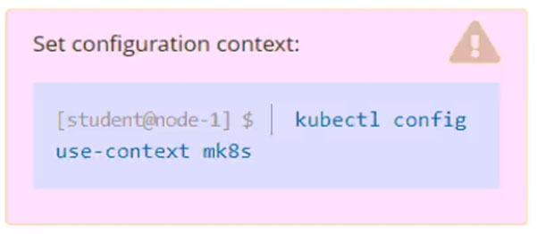
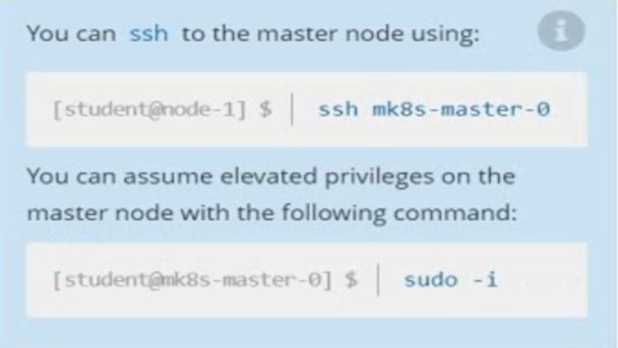
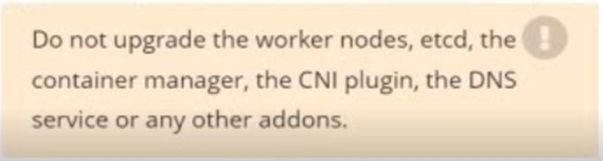
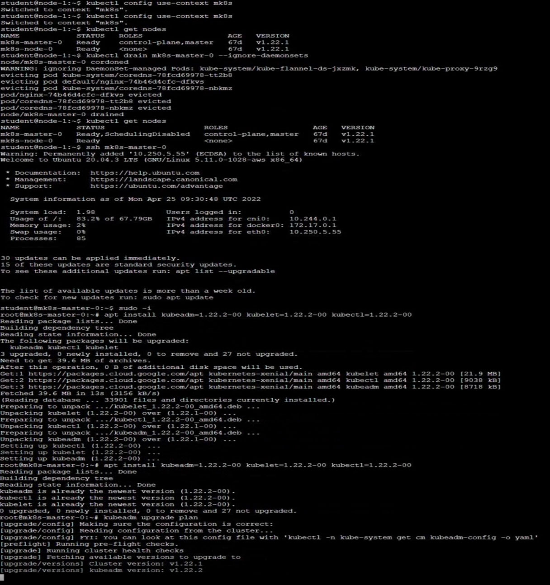
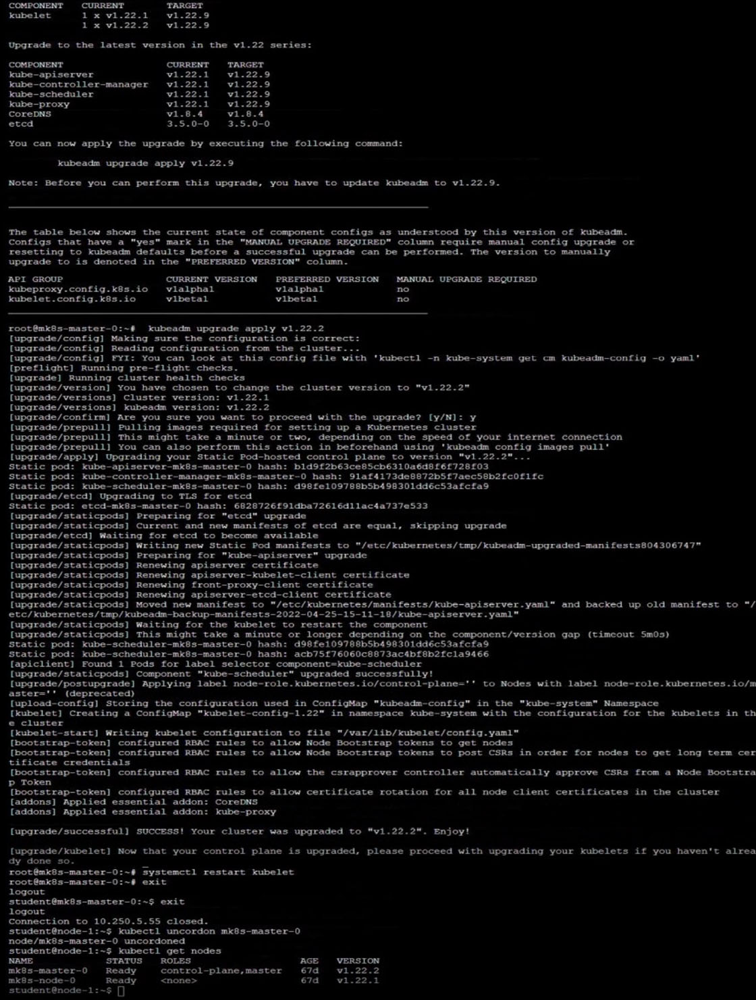

# Question 3:




#### Task -
Given an existing Kubernetes cluster running version 1.22.1, upgrade all of the Kubernetes control plane and node components on the master node only to version 1.22.2.
Be sure to drain the master node before upgrading it and uncordon it after the upgrade.

## Correct Answer: 


You are also expected to upgrade kubelet and kubectl on the master node.



## Correct Answer: 





- Drain node ```mk8s-master-0```
```
kubectl drain mk8s-master-0 --ignore-daemonsets --delete-emptydir-data
```

- SSH to the master node:
```
ssh mk8s-master-0
....
....
sudo -i
```

- Upgrade version & Verify that the download works:
```
apt-get install -y kubeadm=1.22.2-00 kubelet=1.22.2-00 kubectl=1.22.2-00
kubeadm version
```

- Verify the upgrade plan:
```
kubeadm upgrade plan
```

- Choose a version to upgrade:
```
kubeadm upgrade apply v1.22.2
```

- Restar kubelet:
```
systemctl daemon-reload
systemctl restart kubelet
```

- Uncordon the node:
```
kubectl uncordon mk8s-master-0
```