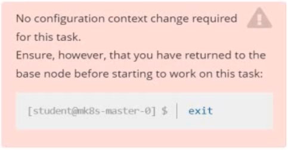
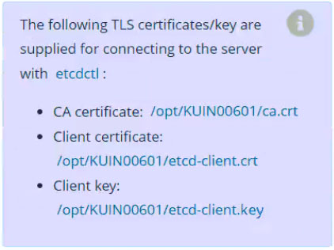
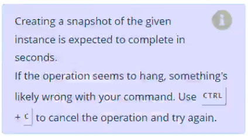

# Question 4:




#### Task -
First, create a snapshot of the existing etcd instance running at https://127.0.0.1:2379, saving the snapshot to ```/var/lib/backup/etcd-snapshot.db```.




Next, restore an existing, previous snapshot located at ```/var/lib/backup/etcd-snapshot-previous.db```.

## Correct Answer:

### Etcd Backup
```
ETCDCTL_API=3 etcdctl snapshot save <backup-file-location> \
  --endpoints=https://127.0.0.1:2379 \
  --cacert=<trusted-ca-file> \
  --cert=<cert-file> \
  --key=<key-file>
```

- First we log into the controlplane and try to create a snapshop of etcd:
```
➜ ssh cluster3-controlplane1

➜ root@cluster3-controlplane1:~# ETCDCTL_API=3 etcdctl snapshot save /var/lib/backup/etcd-snapshot.db --endpoints="https://127.0.0.1:2379" --cacert=/opt/KUIN000601/ca.crt --cert=/opt/KUIN000601/etcd-client.crt --key=/opt/KUIN000601/etcd-client.key
```

- View that the snapshot was successful:
```
➜ root@cluster3-controlplane1:~# ETCDCTL_API=3 etcdctl snapshot status /var/lib/backup/etcd-snapshot.db
```

### Etcd restore
```
ETCDCTL_API=3 etcdctl snapshot restore <backup-file-location> \
  --data-dir=<data-dir-location> \
  --endpoints=https://127.0.0.1:2379 \
  --cacert=<trusted-ca-file> \
  --cert=<cert-file> \
  --key=<key-file>
```

- Now create a Pod in the cluster and wait for it to be running:
```
➜ root@cluster3-controlplane1:~# cd /etc/kubernetes/manifests/

➜ root@cluster3-controlplane1:/etc/kubernetes/manifests# mv * ..

➜ root@cluster3-controlplane1:/etc/kubernetes/manifests# watch crictl ps
```

- Now we restore the snapshot into a specific directory:
```
➜ root@cluster3-controlplane1:~# ETCDCTL_API=3 etcdctl snapshot restore /var/lib/backup/etcd-snapshot.db --data-dir=/var/lib/etcd-backup --endpoints="https://127.0.0.1:2379" --cacert=/opt/KUIN000601/ca.crt --cert=/opt/KUIN000601/etcd-client.crt --key=/opt/KUIN000601/etcd-client.key

2020-09-04 16:50:19.650804 I | mvcc: restore compact to 9935
2020-09-04 16:50:19.659095 I | etcdserver/membership: added member 8e9e05c52164694d [http://localhost:2380] to cluster cdf818194e3a8c32
```

- The restored files are located at the new folder /var/lib/etcd-backup, now we have to tell etcd to use that directory:
```
# /etc/kubernetes/etcd.yaml
apiVersion: v1
kind: Pod
metadata:
  creationTimestamp: null
  labels:
    component: etcd
    tier: control-plane
  name: etcd
  namespace: kube-system
spec:
...
    - mountPath: /etc/kubernetes/pki/etcd
      name: etcd-certs
  hostNetwork: true
  priorityClassName: system-cluster-critical
  volumes:
  - hostPath:
      path: /etc/kubernetes/pki/etcd
      type: DirectoryOrCreate
    name: etcd-certs
  - hostPath:
      path: /var/lib/etcd-backup                # change
      type: DirectoryOrCreate
    name: etcd-data
status: {}
```

- Now we move all controlplane yaml again into the manifest directory. Give it some time (up to several minutes) for etcd to restart and for the api-server to be reachable again:
```
➜ root@cluster3-controlplane1:/etc/kubernetes/manifests# mv ../*.yaml .

➜ root@cluster3-controlplane1:/etc/kubernetes/manifests# watch crictl ps
```

- Then we check again for the Pod:
```
➜ root@cluster3-controlplane1:~# kubectl get pod -l run=test
No resources found in default namespace.
```