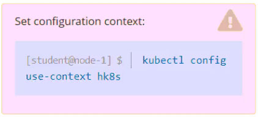
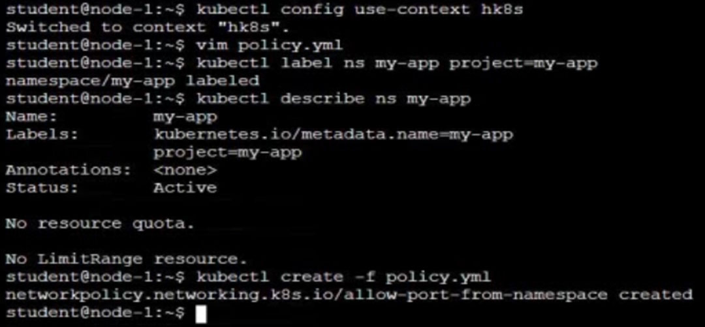
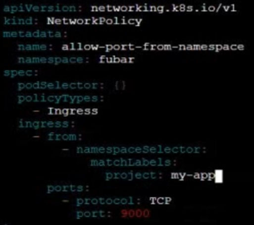

# Question 5:




#### Task -
Create a new NetworkPolicy named allow-port-from-namespace in the existing namespace fubar.
Ensure that the new NetworkPolicy allows Pods in namespace internal to connect to port 9000 of Pods in namespace fubar.
Further ensure that the new NetworkPolicy:

✑ does not allow access to Pods, which don't listen on port 9000

✑ does not allow access from Pods, which are not in namespace internal

## Correct Answer: 




- Create a label:
```
kubectl label ns my-app project=my-app
```

- Create a policy:
```
vi network-policy.yaml
```
```
apiVersion: networking.k8s.io/v1
kind: NetworkPolicy
metadata:
  name: allow-port-from-namespace
  namespace: fubar
spec:
  podSelector: {}
  policyTypes:
    - Ingress
  ingress:
    - from:
        - namespaceSelector:
            matchLabels:
              project: my-app
      ports:
        - protocol: TCP
          port: 9000
```
