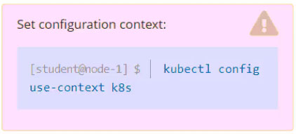
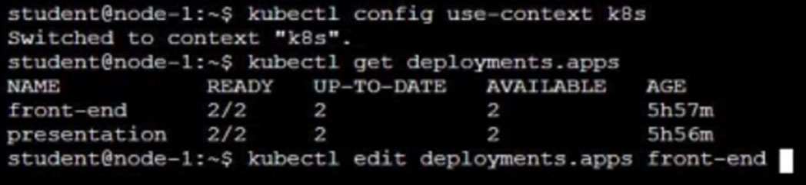
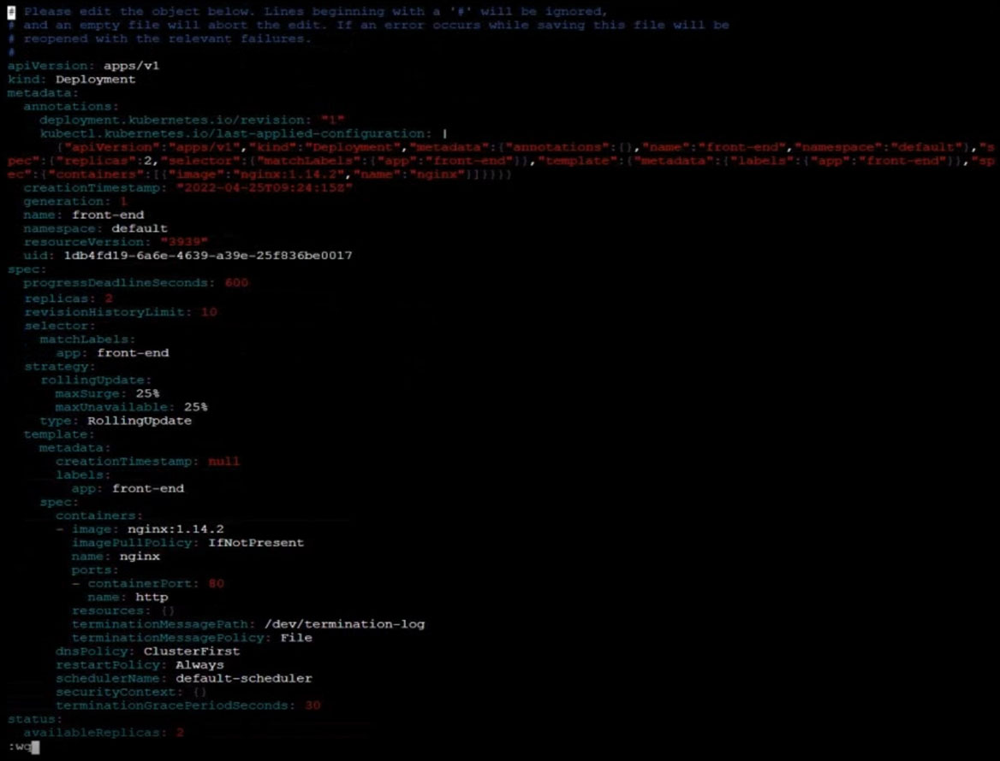
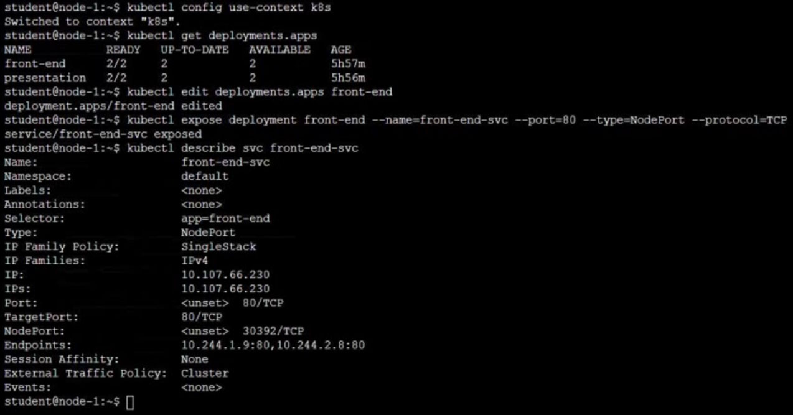

# Question 6:




#### Task -
Reconfigure the existing deployment ```front-end``` and add a port specification named http exposing port 80/tcp of the existing container nginx.

Create a new service named ```front-end-svc``` exposing the container port http.

Configure the new service to also expose the individual Pods via a NodePort on the nodes on which they are scheduled.

## Correct Answer: 





- Add a port specification named ```http``` exposing port 80/tcp (container nginx)
```
$ kubectl edit deployment front-end
...
...
    ports:
      - containerPort: 80
        name: http
...
```

- Create a Service object that exposes the deployment:
```
$ kubectl expose deployment front-end --name=front-end-svc --type=NodePort
```

- Link: https://kubernetes.io/docs/tasks/access-application-cluster/service-access-application-cluster/
- Search: ```service to access app```