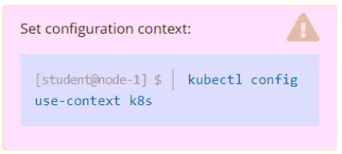
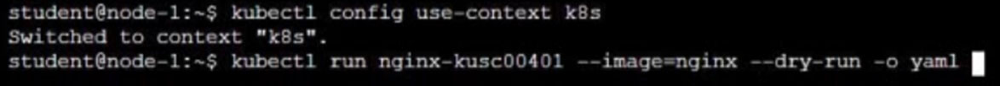
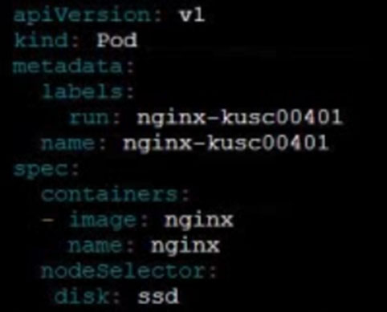

# Question 8:




#### Task -
Schedule a pod as follows:

✑ Name: ```nginx-kusc00401```

✑ Image: ```nginx```

✑ Node selector: ```disk=ssd```

## Correct Answer: 





- Config node selector:
```
$ kubectl run nginx-kusc00401 --image=nginx --dry-run=client -o yaml > pod.yaml

$ vi pod.yaml
apiVersion: v1
kind: Pod
metadata:
  name: nginx-kusc00401
spec:
  containers:
  - name: nginx-kusc00401
    image: nginx
  nodeSelector:
    disk=ssd
```

- Create a Pod:
```
$ kubectl apply -f pod.yaml
$ kubectl get pod -o wide | grep 401
```

- Link: https://kubernetes.io/docs/tasks/configure-pod-container/assign-pods-nodes/
