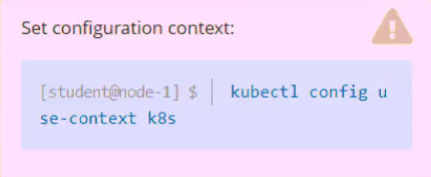
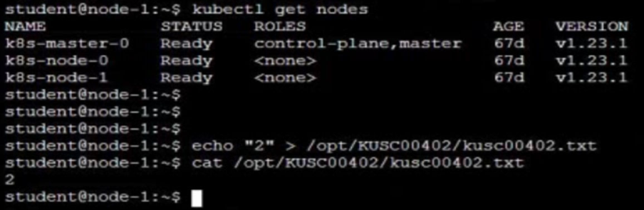

# Question 9:




#### Task -
Check to see how many nodes are ready (not including nodes tainted NoSchedule) and write the number to /opt/KUSC00402/kusc00402.txt.

## Correct Answer:



- Check the node label:
```
$ kubectl describe node | grep -i Taint

$ echo "2" > /opt/KUSC00402/kusc00402.txt
```